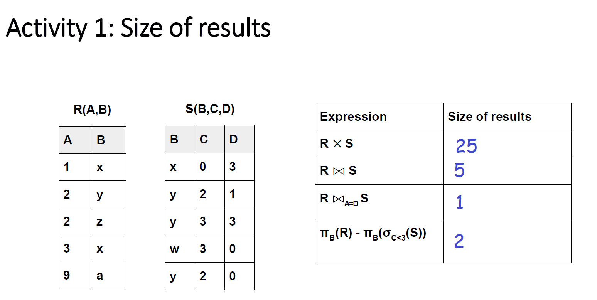

# Day 2 Activity 1: Activity 1: Size of results

- R X S : R cross-join S, Size of results = 5 x 5 = 25
- R  S: R natural-join S, Size of results = 5 : { [A:1, B:x, C:0, D:3], [A:3, B:x, C:0, D:3], [A:2, B:y, C:2, D:1], [A:2, B:y, C:3, D:3], [A:2, B:y, C:2, D:0] }
- R A=D S: R natural-join S with condition A=D, Size of results = 1 : { [A:3, B:x, C:0, D:3] }

- σc<3(S) => select * from S where C < 3 => { [B:x, C:0, D:3], [B:y, C:2, D:1], [B:y, C:2, D:0] }

- πB(σc<3(S)) => select B from S where C < 3 => { [B:x], [B:y], [B:y] }, let this be P.
- πB(R) => select B from R => {B:x, B:y, B:z, B:x, B:a}, let this be Q.
- πB(R) - πB(σc<3(S)) => P but not in Q => Size of results = 2 = { [B:z], [B:a] }

	
	
  